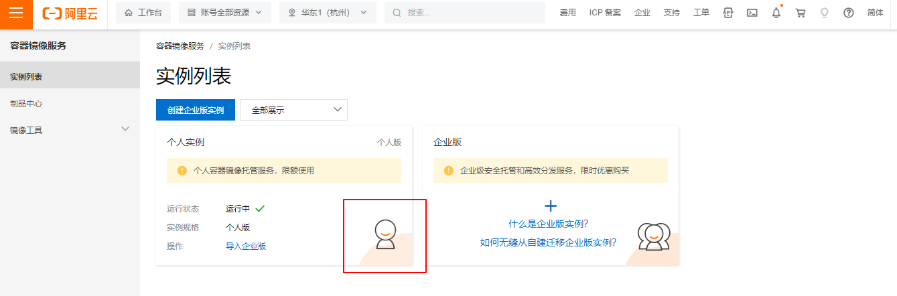
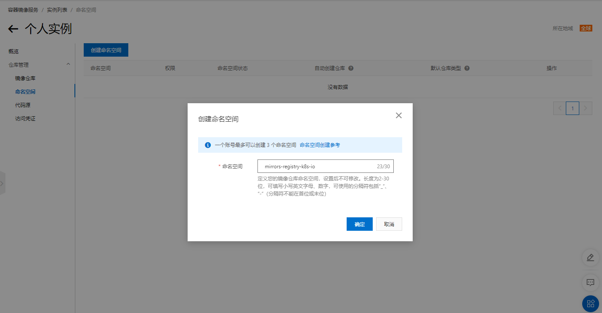
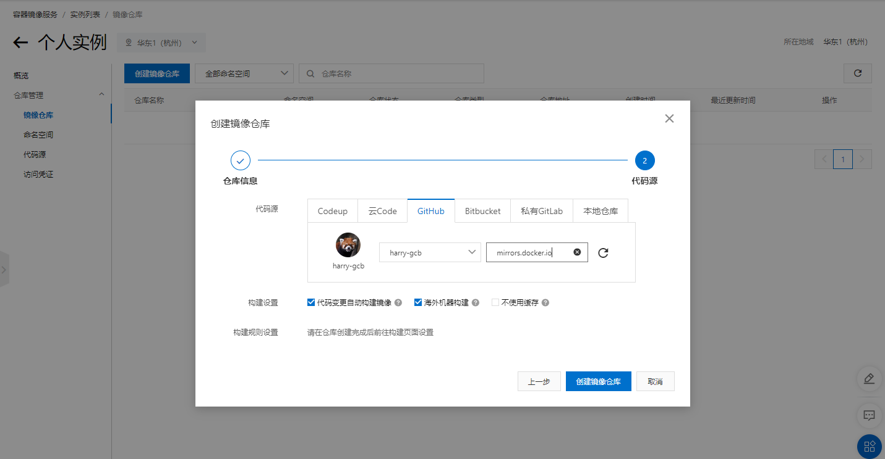
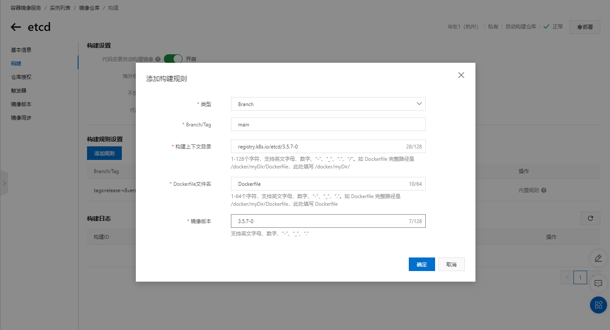
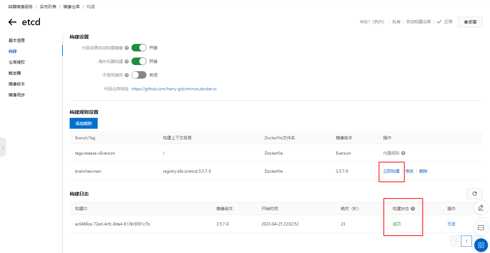

## registry.k8s.io等仓库的镜像下载

由于某些原因，国内无法下载registry.k8s.io镜像，我了解这几种方式可以获取这类镜像：

* 通过国内镜像仓库拉取内容，操作简单，直接拉取即可，但是可能无法获取最新镜像
* 登录Google Cloud Platform/Play with Docker等shell，在这里可以拉取国外镜像，然后使用docker push命令上传到公开的镜像仓库
* 自备梯子
* 通过git+镜像服务拉取镜像

本篇记录第四种方式，虽然略微繁琐，但是能保证获取到我需要的镜像，在此以获取etcd镜像为例

### 创建git仓库

创建一个github仓库，上传Dockerfile文件，文件内容为需要拉取的镜像

```dockerfile
FROM registry.k8s.io/etcd:3.5.7-0
```

### 创建阿里云镜像仓库

登录阿里云，进入[容器镜像服务](https://cr.console.aliyun.com/cn-hangzhou/instances)，选择一个数据中心进入个人实例



进入个人实例后首先创建命名空间



之后创建镜像仓库，绑定github账号并选择海外构建





在这之后便可以构建需要的镜像



添加构建规则之后点击立即构建，可以看到构建状态为成功，即可下载此镜像进行使用


